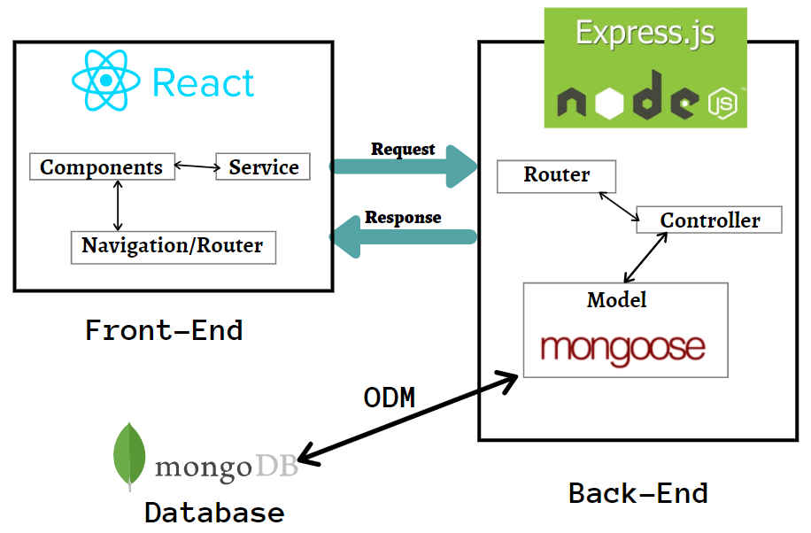
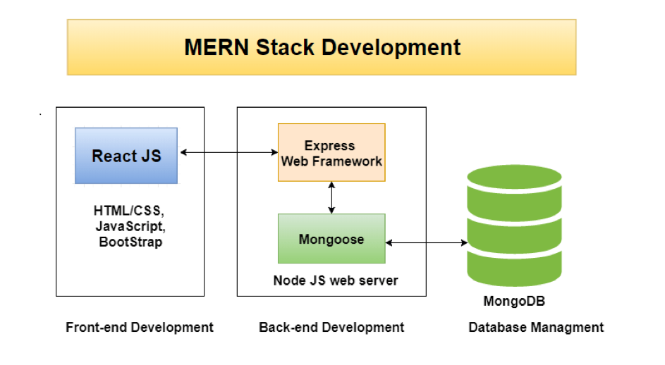

<p align="center">
  <a href="#">
    
  </a>
</p>
<h3 align="center">Create, build and deploy MERN stack applications with breeze.</h3>

## Introduction
A Fullstack MERN support ticket system with Redux Toolkit.



## Getting Started


### Built With

This section should list any major frameworks/libraries used to bootstrap your project.

* [MongoDB Atlas](https://www.mongodb.com/atlas/database)
  **Database**. Deploy a multi-cloud database.
  The most advanced cloud database service on the market, with unmatched data distribution and mobility across AWS, Azure, and Google Cloud, built-in automation for resource and workload optimization, and so much more.
* [MongoDB Compass](https://www.mongodb.com/products/compass)
  **Compass**. The GUI for MongoDB.
  Compass is an interactive tool for querying, optimizing, and analyzing your MongoDB data. Get key insights, drag and drop to build pipelines, and more.
* [ExpressJS](https://expressjs.com/)
* [React.js](https://reactjs.org/)
* [NodeJS](https://nodejs.org/en/)
* [Redux Toolkit](https://redux-toolkit.js.org/)
* [Postman](https://www.postman.com/)


### Deployed On
* [HEROKU](https://heroku.com/)
  
  [Support Ticket App](https://support-desk-mern-arifmd.herokuapp.com/)

### Installation

### .env

Lets create a `.env` file in the root of the project:

```bash
touch .env
```

Then put the following code in that `.env` except you should add your details.

```bash
NODE_ENV = development
PORT = 5000
MONGODB_URL=<your_mongodb_connection_string>
JWT_SECRET=<your_secret_key>
```

Provided in the root of the project, a `.sample.env` for guidance.


### Folder Structure

```
├── README.md
├── backend
│   ├── config
│   │   └── db.js
│   ├── controllers
│   │   ├── noteController.js
│   │   ├── ticketController.js
│   │   └── userController.js
│   ├── middleware
│   │   ├── authMiddleware.js
│   │   └── errorMiddleware.js
│   ├── models
│   │   ├── noteModel.js
│   │   ├── ticketModel.js
│   │   └── userModel.js
│   ├── routes
│   │   ├── noteRoutes.js
│   │   ├── ticketRoutes.js
│   │   └── userRoutes.js
│   └── server.js
├── frontend
│   ├── README.md
│   ├── package-lock.json
│   ├── package.json
│   ├── public
│   │   ├── favicon.ico
│   │   ├── index.html
│   │   ├── logo192.png
│   │   ├── logo512.png
│   │   ├── manifest.json
│   │   └── robots.txt
│   └── src
│       ├── App.js
│       ├── app
│       │   └── store.js
│       ├── components
│       │   ├── BackButton.jsx
│       │   ├── Header.jsx
│       │   ├── NoteItem.jsx
│       │   ├── PrivateRoute.jsx
│       │   ├── Spinner.jsx
│       │   └── TicketItem.jsx
│       ├── features
│       │   ├── auth
│       │   │   ├── authService.js
│       │   │   └── authSlice.js
│       │   ├── notes
│       │   │   ├── noteService.js
│       │   │   └── noteSlice.js
│       │   └── tickets
│       │       ├── ticketService.js
│       │       └── ticketSlice.js
│       ├── hooks
│       │   └── useAuthStatus.js
│       ├── index.css
│       ├── index.js
│       ├── pages
│       │   ├── Home.jsx
│       │   ├── Login.jsx
│       │   ├── NewTicket.jsx
│       │   ├── Register.jsx
│       │   ├── Ticket.jsx
│       │   └── Tickets.jsx
│       └── serviceWorker.js
├── node_modules
├── package-lock.json
└── package.json
```

### Run backend & frontend servers concurrently

In order to run the backend & frontend servers using concurrently:

```sh
npm run dev
```

This will automatically open the local development server at [http://localhost:3000](http://localhost:3000).

The page will automatically reload if you make changes to the code.<br>
You will see the build errors and lint warnings in the console.

### Routes

Inside of `/backend/controllers/userController.js` are a collection of routes that involve the five primary `CRUD` functions of persistent storage.

- **POST** `/api/users` - Registers a new user, requires a `json` object, containing { name, email, password }
- **POST** `/api/users/login` - Login a user
- **DELETE** `/api/delete_a_data/:dataId` - Deletes a single document from the database, based on a dataId.
- **PATCH** `/api/update_a_data/:dataId` - Updates a single document from the database, based on a dataId.

Inside of `/backend/controllers/ticketController.js` are a collection of.

- **GET** `/api/tickets` - A test route used in development.
- **POST** `/register` - Registers a new user, requires a `json` object, containing { name, email, password }
- **POST** `/login` - Logs in an existing user, requires a `json` object, containing { username: String, password: String }
- **GET** `/logout` - Logs out a logged in user.
- **GET** `/authenticated` - Checks to see if user is logged in. Used for protecting routes.
- **POST** `/admin` - Checks to see if a user is an admin. Used for protecting routes.
- **GET** `/create_a_data` - Adds a data to the users record. This is used as private data storage.
- **GET** `/get_all_datas` - Gets all private data from the user.

### Build an application

In order to make a production build of your application:

```sh
npm run build
```

This will produce an optimized build of your application in `build` folder.

### Deploy your application

In order to produce a ready-to-deploy version of your application to deploy to Heroku:

```sh
npm run deploy
```

This will produce a ready-to-deploy version of your application in `deploy` folder. 
Now you can deploy your application by running few handful commands:

```sh
cd deploy
heroku login
git init
git add *
git commit -m "deploying my-app"
heroku create my-app
git push heroku master
```
And within a few seconds, your application will be live at [https://my-app.herokuapp.com/](https://my-app.herokuapp.com/).


## Author(s)

- **Mohammad Arif** - _Initial work_ - [mdarif](https://github.com/mdarif)
